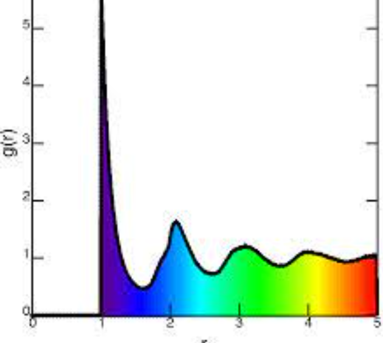

# Weekly progress journal

This README file is a Weekly progress journal of the project. The weekly progress journal is a tool that we used in our gitlab repo as a was of continuous assesment, as well as to keep track of the whole project as a team. In this repo you can find all the code developed for the Project 1 of the Computational Physics course (AP3082 of the Applied Physics Master programme at TU Delft). The project is about developping a model of a *Molecular dynamics simulation of Argon atoms*. You can find more details in the report of the project CP_Project_1.pdf.

## Instructions

In this journal you will document your progress of the project, making use of the weekly milestones.

Every week you should 

1. write down **on the day of the lecture** a short plan (bullet list is sufficient) of how you want to 
   reach the weekly milestones. Think about how to distribute work in the group, 
   what pieces of code functionality need to be implemented.
2. write about your progress **until Monday, 23:59** before the next lecture with respect to the milestones.
   Substantiate your progress with links to code, pictures or test results. Reflect on the
   relation to your original plan.

We will give feedback on your progress on Tuesday before the following lecture. Consult the 
[grading scheme](https://computationalphysics.quantumtinkerer.tudelft.nl/proj1-moldyn-grading/) 
for details how the journal enters your grade.

Note that the file format of the journal is *markdown*. This is a flexible and easy method of 
converting text to HTML. 
Documentation of the syntax of markdown can be found 
[here](https://docs.gitlab.com/ee/user/markdown.html#gfm-extends-standard-markdown). 
You will find how to include [links](https://docs.gitlab.com/ee/user/markdown.html#links) and 
[images](https://docs.gitlab.com/ee/user/markdown.html#images) particularly
useful.

## Week 1

*Note to André Melo: The journal did not specify every thing that was done by each of the members of the group because we did not know we had to do that.
On the other hand, it also contained some not-matching names of the functions we really created in the main.ipynb script. Please find the journal items corrected now
and we will try to specify better how we share the workload in the project.*

### To implement the Euler evolution we will:

* First initialize the positions and velocities of the particles (in 2D first) in random values. -DONE-

* Create the function 'rel_pos' which finds an array of arrays of the vectorial position between one particle considered and another one.  -DONE-

* Create the function 'rel_dis' which finds an array of the absolute distance between one particle considered and another one. -DONE-

* Create a function 'force' which finds an arry containing the total force felt by a particle due to the rest of the other particle positions. -DONE-

* Create a function 'back' that will be called after every step we compute the next step positions and velocities, that puts the particles that have stepped
  out of the box back into it again. -DONE-, need to be revised this Week 2-
  
* Create a function 'closest_rel_pos' that does the same as 'rel_pos' but taking into account that now the particle may be in one of the virtual domains.
  -DONE, needs to be revised this Week 2-

* Create a function 'potential' that computes the total potential of the system given the positions of all particles (this will be used to compute the total energy).
  -DONE-

* Create a function 'partmove' that runs the simulation for a given number of times and a given timestep. It tracks the positions of all the particles in every
  timestep. -DONE-

### Future plans

1. Settling up the energy computation of the system in all timesteps in 'partmove' (and check whether it is conserved or not).

2. Move the functions to a separate .py file.

3. Try to get rid of some unnecessay loops.

4. Clean functions (use same variable for the positions, erase 'print' check statements, etc.

We also put an image that shows our idea about the computational flow of the script. Can find it attached below.

## Week 2

### To implement the natural units we will:

* Work out the dimensional variables/parameters we can factor out of the Newton equation. -DONE-

* Upgrade the code so it solves the adimensional Newton equation. -DONE-

There two ways to implement the above. We can:
1) Either divide all physical quantities by the correct combinations of sigma, epsilon and m that have the same dimensions with the corresponding physical quantity. ([Energy] = epsilon, [Position] = sigma, [Time] = (m*sigma^2/epsilon)^(1/2), [Velocity] = sqrt(epsilon/m))
2) Or set **sigma = epsilon = m = 1**

In the case of kinetic energy **Georgios Stylianou** used the first method on kinetic energies to obtain the corresponding dimensionless ones.

### To implement the minimal image convention we will

* Revisit the functions 'back' and 'closest_rel_pos' + 'force' to make to make them: 

  * Be computationally efficient -DONE-
  * Check that they are indeed correct (analytical computation of 'closest_rel_pos' for 3 particles for instance). -DONE-

  1) **Georgios Stylianou:** Improved the function **bring_back(L, pos)** which checks if the position of a particle lies outside the box and if that is the case it brings it back in. Note that pos is a N x dim matrix that gives the coordinates of all particles.

  2) **Georgios Stylianou:** Improved the function **closest_rel_pos(pos)** such that it finds the closest relative position vector (**Rij**) between each pair of particles inside the box, by also taking into account the virtual images of the second particle. It basically implements the minimal image convention.

  3) **Georgios Stylianou:** Created the function **closest_rel_dis(pos)** which basically utilizes the **closest_rel_pos(pos)** function to compute from the closest relative position vector the closest relative distance.

  4) **Georgios Stylianou:** The **force(pos)** and **potential(pos)** functions where altered so that they take into account the minimal image convention. Likewise, the -for loops were eliminated from the potential but I was unable to achieve the same for the force.

  5) **Georgios Stylianou:** The **bring_back** and the upgraded **force** function where used inside the **partmove(pos, vel, m, h, lpn)** function that tracks the coordinates of all particles at each timestep (#timesteps X particles X dimensions)

  6) **Georgios Stylianou:** Developed the **kin_energy(initpos, initvel)**, **pot_energy(initpos, initvel)**, **total_energy(initpos, initvel)**, which compute the respective energies of each particle, as well as the whole system's for all timesteps.

  NOTE: We tried to avoid -for loops as much as possible. But in many cases this did not seem possible. Maybe we are lacking some knowledge of all the functions numpy offers. We can discuss this during the lecture.

**Carles**

### Upgrade the whole code for 3 dimensions

The code was initially developed to sustain any dimension. The only thing we need to change is the value of the "dim" variable at the beginning from 2 to 3. Slight changes to the function parameters when migrating the functions that we use in the code into a separate 'functions.py' file had to be done.

### Migrated the functions of the code to a separate 'functions.py' file

* To accomplish this we:

  1) Put the functions in to a separate file and called them in main.
  
  2) Introduced all the necessary variables into the functions arguments.
  
  3) Built detailed docstrings.
  
  4) Erased parameters with units to work with dimensionless units.

### Plot desired results (milestones of the week)

* To check the minimal image convenction, started on Week 1 and polished on Week 2, we obtained the results that the last milestone asks for:

  1) We commented the lines that prepare a random poisition and velocity set of particles to create just two, one of them very close to the bounday. This way, we checked that the boundary conditions workl properly, the vectors have the correct direction and so do the forces that each of the particles feel. *Note: The length of the box has beel computed according to the formula which involves the number of particles in the system and the dimensions. However, a '+2' is addded on that final number since for so many few particles the length of the box is too small and makes our particles position go away of the domain if the particles are close, which is the case if L=1 is considered, even for very small timesteps.*
  
  2) We set the timestep to a reasonable value to see the particle's motion evolve.
  
  3) We plotted the relative inter-atomic distances over time. We took 500 steps to obtain the graph available in the 'main.ipynb' file and here below. We observe that the inter-atomic distance oscillates around a reasonable value (in dimensionless units) of the order of the unity (around 2). In this case, since the atomic distance has been computed directly from the difference of the particle's positions without taking into account the boundary conditions possible nearest distence, abrupt changes on the distance may be due to when the particle crosses the boundary
  

* Improvement:

  1) We also tried to plot the same inter-atomic distance taking into account the boundary conditions. We obtained the following result (see also 'main.ipynb'). This approach is better sice the interatomic distance taends to oscillate around a lower (more reasonable) value (nearer to 1) and ot looks it tends to it.
  
")

* To check the energies function we also plot the results

  1) We obtained the time evolution of the kinetic, potential and total energy of the system, this time taking into account the boundary conditions. We obtain that the kinetic energy has an upwards slight trend and the potnetial energy tend to decrase slightly too. We can say that the total energy oscillates around an cosntant value altough with a lot of fluctuations (at least at the considered scale. We can also see the results below

Additional notes:

* *We note that we loop two times to do the same time evolution of the particle, one to get the distances and another one to obtain the energies. We are aware that this has a big computational cost that we should minimize but we do not know if doing it is possible.*

* *Our approach (and the one shown in the lectures) to make the 'bring_back(L, pos)' function is based on the fact that for a single timestep one particle that steps out of the considered domain cannot travel further to go to out of the virtual domains that surround our actual one.*

## Week 3

*The milestones of this week are the following:

### Extending the code to more than 2 particles

Our code was already built for anarbitrary amount of particles N so we can choose the amount of particles in every run just changin the value assigned to the variable N.

### Implement the velocity-Verlet algorithm + investigate conservation of energy of the system and compare the results to Euler's last week results

* To do that **Georgios Stylianou** did:

  1) Create a 'Week2.py' file to store the way we obtained the results from the previous week and created 'Week3.py' with the code necessary to obtain the results asked for this week (see further milestones.
  
  2) Plot the desired results for $N=4$ and $N=8$ using the Euler algorithm (modifying slightly last week's code). We see the following:
  
      * Overall we note that the total energy of the system oscillates between 0 and 1.0. 
      * Comparing the graphs for 8, 4 and 2 (week 2) particles we observe that the more particles we add to the system, the less aggressive the oscillation of the total energy is (smoother graph).
      * Another observation is that if we let the positions of the particles to be chosen randomly the potential of the system blows up. As we have already commented, this is due to particles having very near initial positions makes the ()^12 term huge.
      * Assuming that the initial rapid increase is due to problematic initial positions we observe that the fluctuations of energy are of the order of ~ 0.4.
  
  3) Implement the velocity-Verlet code and use it to obtain results instead of the 'partmove' function.
  
  4) Modify the energy functions so that they can give results with the 'vel-verlet' function instead of the 'partmove function.
  
  5) Plot the desired results for $N=4$ and $N=8$ using the velocity-Verlet algorithm (modifying slightly last week's code).
  
  5) Compare the behaviour. We can see the plots below, as well as in the 'Week3.py' file.
  

We can comment that as it can be clearly seen by comparing the graphs of Euler vs Verlet (see "Euler_Verlet_Energy_Comparison.png"), the energy curves are somewhat smoothened by Verlet's but not as much as we would expect. It is also visible that the situation improves, the more particles we add to the system.

  6) !!! Correction: The energy was not conserved in our previous graphs! This was all because we had a wrong sign infront of the force. We changed it and our new, upgrated graphs appear to conserve the energy (especially for Verlet, the total energy is a completely straight line) !!!

### Structure the code properly

* The code is already structured with a migrated file 'functions.py' with all the functions that we call in our main files. Moreaover, from this week on, the main file we use will be stored in 'Week#.py' file, where # is the number of the week, to be easily accessible.

* Also, **Carles Esteve** did some further changes:

  1) Modified 'bring_back' and 'closest_rel_pos' funcitons so we do not have to loop over all the particles that have escaped our domain, using the 'numpy mod' function.
  
  2) Actualized the respective docstrings.
  
  3) Created two functions to initialize the positions of the paricles according to any square lattice (milestone for Week4).
  
    * The functions are avaliable for a sqare domain in 2D and in 3D.
    
    * The functions are optimized to loop only for the position vecotors of the particles in a cell (for FCC it is a 4 vectors loop).

## Week 4

This weeks milestones were accomplished accoring to the following descriptions:

**Georgios** did:

1) Correct the positions initialization accoring to an fcc lattice.

2) Merge the velocities initialization from Maxwell-Boltzmann distribution proposed in Week1 into a full initialization of the particles.

3) Derive the necessary objects in dimensionless units and perform the rescaling to the code.

**Carles** did:

4) Create the funcitons necessary to compute the observable: preassure.

5) Obtain code to plot results.

As the instructor mentioned, we also erased all the backup files where we stored the previou's weeks code so the repository looks cleaner, given that the git itself takes care of soring the previous versions of everything.

## Week 5

We started this week's progress by improving week's 4 code and creating more.

1) We checked wether the initialization of the positions did not fit that of an fcc lattice, as it was mentioned in the email, but by printing the initial positions of the particles we did not find anything wrong. More precisely, by printing the positions for 32 particles in a 3D box of length L = 8 with unit cells of size a = 4 (2 x 2 x 2 = 8 cells in the box) we had the following results:

[[0. 0. 0.]
 [0. 0. 4.]
 [4. 0. 0.]
 [4. 0. 4.]
 [0. 4. 0.]
 [0. 4. 4.]
 [4. 4. 0.]
 [4. 4. 4.]
 [0. 2. 2.]
 [0. 2. 6.]
 [4. 2. 2.]
 [4. 2. 6.]
 [0. 6. 2.]
 [0. 6. 6.]
 [4. 6. 2.]
 [4. 6. 6.]
 [2. 0. 2.]
 [2. 0. 6.]
 [6. 0. 2.]
 [6. 0. 6.]
 [2. 4. 2.]
 [2. 4. 6.]
 [6. 4. 2.]
 [6. 4. 6.]
 [2. 2. 0.]
 [2. 2. 4.]
 [6. 2. 0.]
 [6. 2. 4.]
 [2. 6. 0.]
 [2. 6. 4.]
 [6. 6. 0.]
 [6. 6. 4.]]

which perfectly match the desired ones. NOTE: We did not include points that lie on the boundary of the box (any of their coordinate >= L). Thus, out of 8 cells in the box, one cell would not have any particles on 3 of its sides, 3 cells would not have on 2 of their sides and 2 cells in one of their sides. Only one cell has particles on all of its sides (the one at the origin). The reason this is done is because of the periodic boundary conditions. If we were to include points on the boundary, they would have been projected on already occupied points on the other side of the box as the following pictures indicates:

The fact that we did not include the particles on the sides does not create any problems though because their contribution to the force is included thanks to the minimal image convention.

2) The second thing of week 4 that we did in week 5 was to create the Pair Correlation Function. More about this can be found on the "functions.py" file and more precisely on the function: "pair_correlation", "pair_correlation2" and in the last part of the function "observables". We created histograms for both the particle pairs per mean relative distance (n(r)) as well as the Pair Correlation Function. We used 15 bins in the first images (32 particles) and 100 bins in the last (256 particles). We obtained the results depicted in the following images:

")

")

For comparison we provide the form that the Pair Correlation Function should have:

We believe that the form that we obtained matches that of the theoretical curve.

3) We also created the "rescale" function as an independent function instead of performing the rescale by calculating the energies every time we wanted to measure another observable. The rescale function simply measures the kinetic energy and computes lamda for the temperature provided. Once lamda is sufficiently close to 1 and equilibrium is achieved all sets of positions and velocities of the particles are taken from the last timestep and used as "new" initial positions. Then using these as initial positions the observables are measured.

In order to ensure that this rescaling worked, we used the -already existing- "energy_rescale" function with the non-refined initial conditions and then with the refined ones (after the "rescale" function was utilized to refine them). The two cases are depicted in the following images:

For non-refined initial conditions, and

For refined ones. (Full image was too large to be uploaded in jupyter)

We observe that although there is still some rescaled performed for refined initial conditions, it is only done once and it is very small.

All the obove were done for 32 particles. We also plotted the energy rescaling (non-refined initial conditions) for 108 particles. The measurement took around 90 minutes which we consider a lot. The following figure emerged:

4) So now we move on Week's 5 progress. As it can be found on "Week5.py" we first defined a test function there (autocorr), that generates the Autocorrelation Function of a given 1D array (e.g., an observable measured in different timesteps). We used the code provided on the lecture notes to generate a couple of sequences of fixed correlation time τ, and then fitted their autocorrelation function, as found by "autocorr", to see if the correlation time computed via this fitting matched the one inserted manually. The results were satisfying in most cases as it can be seen in the corresponding part of the code in "Week5.py".

5) Once we confirmed that our Autocorrelation Function computation worked, we merged it into the "autocorrelation" function found in the function file. This function there, other than finding the Autocorrelation F., also plots it in relation to time and computes the mean value of the given array, its correlation time (via fitting) and finally its standard deviation.

6) Finally, once we could find the mean values and errors of any given sequence, we used this code in a function dedicated exclusively to the computation of the pressure and its errors("pressure" function in the corresponding file). The results were consistent with previous measurements of the pressure giving the value 0.0410 to it and 0.0001 to the error (both dimensionless). Bellow you may find the plots of the Autocorrelation function for the energies and the pressure:

Overall, judging from the figures obtained we believe that our code gives the correct results. The only problem is that it takes too long to make the computations. As mentioned before, for 108 particles and 8004* timesteps it took approximately 90 minutes to compute the energies (including 4 rescalings). Likewise, for 256 particles it required ~75 mins to create the pair correlation histogram. We think that although we are using too many timesteps, the speed of the computations could be improved, so that we could run a simulation for even more particles. This could be done by decreasing further the number of -for loops used in our code. So far we have not found a way to do so for the loops remaining. 
